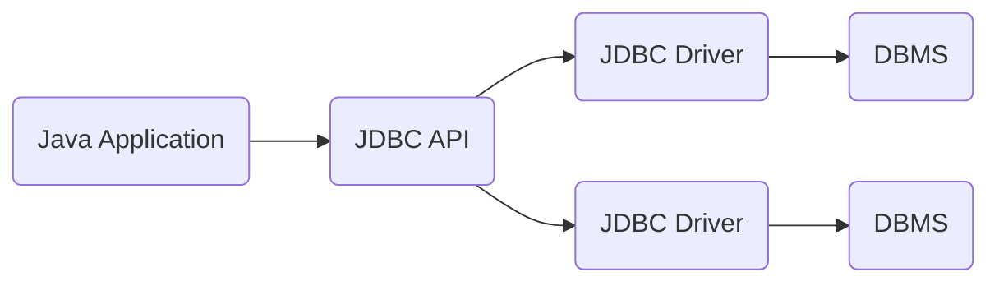

#1. JDBC란?
>JDBC : Java DataBase Connectivity   

말 그대로, 자바와 데이터베이스를 이어주는 역할을 하는 프로그래밍 인터페이스이다.

#2. JDBC를 사용하는 과정
1. 사용하는 DBMS에 맞는 JDBC 드라이버를 로드한다
2. DB와 연결을 진행한다(URL, 계정 정보 등을 입력, 주로 DriverManager.getConnection(url, id, pwd) 메소드를 이용)
3. SQL 문을 통해 DB와 통신 진행
4. DB와 연결 종료

#3. Spring 프로젝트에 세션 저장소 만들기
##3-1. 세션 저장소를 구현하는 방법
일반적으로 세션 저장소는 3가지 방법 중 하나를 이용해 구현한다.
###1. 톰캣 세션
세션 저장소에 대한 별다른 설정을 하지 않으면 톰캣의 메모리에 세션 데이터가 저장된다.   

####장점 
- 가장 쉬운 방법이다.   

####단점 :
- 만약 2대 이상의 웹 어플리케이션 서버를 사용한다면, 두 서버에 올라가 
있는 톰캣 간의 세션 동기화를 해 줘야 하는 불편함이 있다.

###2. DB를 세션 저장소로 사용
말 그대로 DB에 세션 정보를 저장한다.
####장점 
- 2대 이상의 WAS를 사용하는 경우에도 별도의 세션 동기화 작업을 할 필요가 없다.
- 설정이 그렇게 복잡하지 않다.

####단점 
- 로그인 요청마다 DB I/O가 발생하므로, 로그인 요청이 많은 서비스라면 성능 이슈가 발생.

보통 로그인 요청이 많지 않은 사내 시스템, 백오피스 용도로 사용하는 경우가 많음.

####3. Redis, Memcached와 같은 메모리 DB를 사용
####장점
- '메모리' DB이므로, 일반 DB에 비해 월등한 성능을 제공.

####단점
- 결국 외부의 메모리 서버를 사용해야 하므로, 해당 서버에 문제가 발생하면 데이터 유실 위험이 있음. (인메모리 DB의 특성)
- 외부의 메모리 서버를 이용하는 '비용 발생'

규모가 큰 서비스에서 가장 많이 사용하는 방식.   

##3-2. Spring boot 에서 DB를 세션 저장소로 이용하기
Spring boot 에서 2번 방식을 이용해 세션 저장소를 만드는 방법은 다음과 같다.
1. 프로젝트에 다음과 같은 의존성을 추가한다.
>implementation('org.springframework.session:spring-session-jdbc')
2. application.properties 파일에 다음 코드를 추가한다.
>spring.session.store-type = jdbc

끝이다!